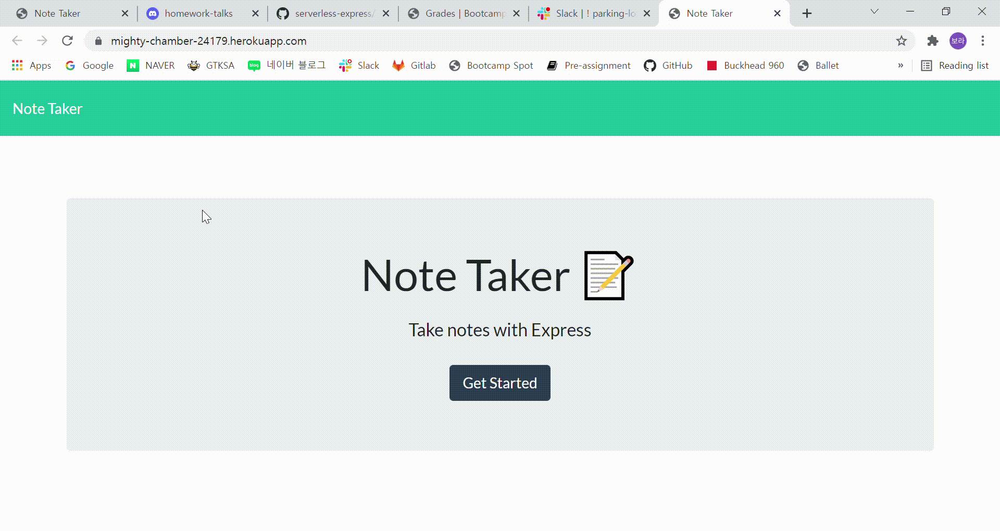

# Homework11_Express_NoteTaker

## Description 

You can create and save notes from the page. The saved notes will be displayed in the left side and if you click the left notes, then it presents to the right column. Also, you can go back to add-note mode by clicking + button at the top.

---

Deployed page : https://mighty-chamber-24179.herokuapp.com/

Page Demo 

---

## Table of Contents 

- [Installation](#Installation)
- [Usage](#Usage)
- [License](#License)
- [Contributing](#Contributing)
- [Test](#Test)
- [Question](#Question)

## Installation

  ---
  To install necessary depedencies, run the following command :
  
  **npm install**

  ---

## Usage

  It uses Express and uuid modules.

## License

    There is no license here.
    

## Contributing

nothing

## Test

  ---
  To run the test, run the following command:
  
  **no test**

  ---

## Question

If you have any question about the repo, open an issue or contact me directly at bbora1119@gmail.com. You can find more of my work at https://github.com/radoll93.

  